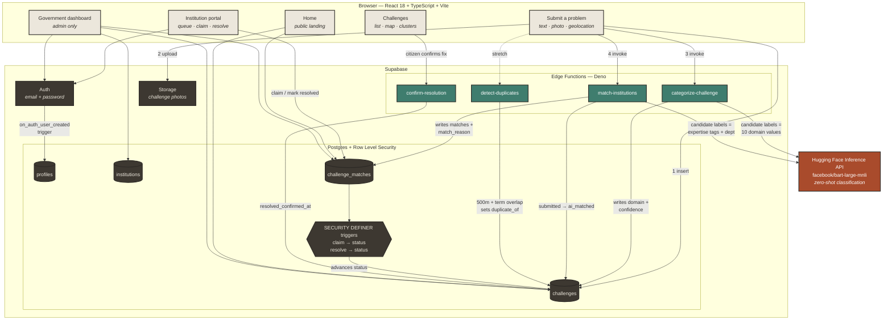
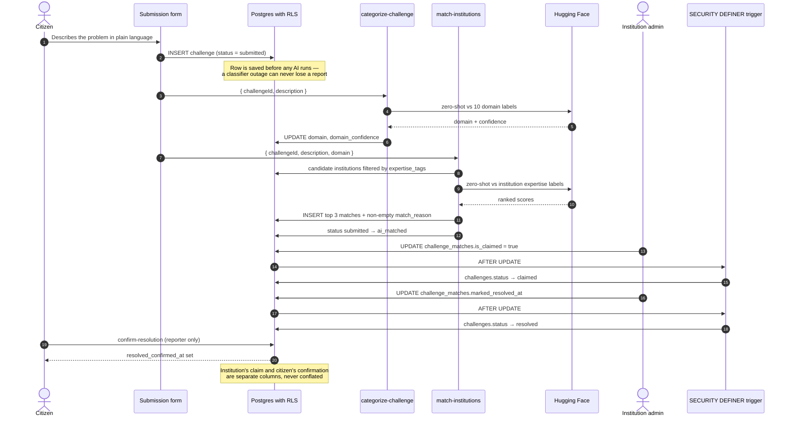
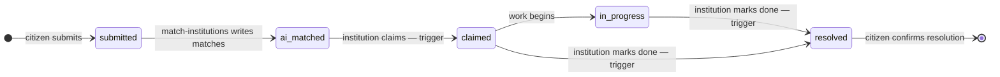
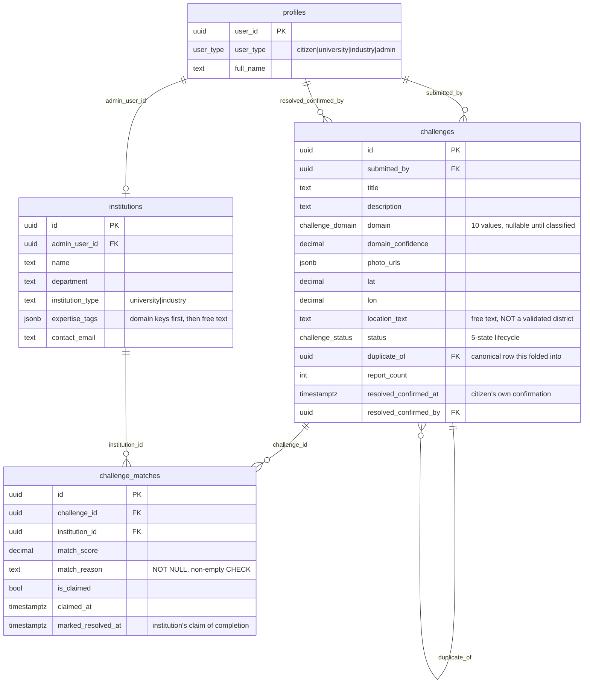

# Societal Innovation Collaboration Portal

**Smart India Hackathon 2026 · Problem Statement SIH26043**
Department of Higher & Technical Education, Government of Jharkhand

A platform where citizens report real local problems in plain language, an AI
classifier sorts each one by subject and routes it to the university or
industry partner whose expertise actually fits, and the whole pipeline is
tracked publicly through to a resolution the original reporter confirms.

Positioned as a NEP-2020-aligned research and innovation pipeline — **not** a
generic civic complaint app. The AI matching and duplicate clustering are the
parts that make it a research pipeline rather than a grievance inbox.

---

## Table of contents

- [Why this exists](#why-this-exists)
- [The three MVP modules](#the-three-mvp-modules)
- [Architecture](#architecture)
- [How a report actually flows](#how-a-report-actually-flows)
- [Tech stack](#tech-stack)
- [Data model](#data-model)
- [Edge functions](#edge-functions)
- [Security model](#security-model)
- [Design principles that shaped the code](#design-principles-that-shaped-the-code)
- [Project structure](#project-structure)
- [Running it locally](#running-it-locally)
- [Database setup](#database-setup)
- [Verification](#verification)
- [Scope: what is deliberately not built](#scope-what-is-deliberately-not-built)

---

## Why this exists

A near-identical idea (SIH25031) was already submitted by the same state in a
prior cycle as a civic complaint portal. The differentiators here are
deliberate:

| Differentiator | What it means in practice |
|---|---|
| **Explainable AI matching** | Every match carries a written, human-readable reason — enforced at the database level, not by convention |
| **Duplicate clustering** | 30 reports of the same broken handpump collapse into one card with a real report count, instead of 30 rows |
| **Two-party resolution** | An institution marking work done and a citizen confirming it are *separate columns*. An institution cannot sign off its own work |
| **Honest metrics** | Nothing in the UI displays a number that isn't a live database read. Where no real data exists, the element is hidden rather than filled |

---

## The three MVP modules

1. **Citizen submission + AI categorisation & matching** — plain-language
   report in, subject classification and ranked institution matches out.
2. **Institution claim workflow** — matched partners see their queue, claim
   ownership, and mark work resolved.
3. **Government dashboard** — department-facing analytics over the live
   pipeline.

---

## Architecture



---

## How a report actually flows



### Lifecycle



The five states are rendered in the UI as **mineral strata** — horizontal
layered bands a challenge visibly moves through — rather than generic numbered
step badges. Jharkhand's identity is built on coal, mica and iron-ore strata;
the lifecycle visualisation borrows that vocabulary.

---

## Tech stack

| Layer | Choice | Notes |
|---|---|---|
| Frontend | React 18, TypeScript, Vite 6 | `@vitejs/plugin-react-swc` |
| Styling | Tailwind CSS 3, shadcn/ui, Radix primitives | Warm broadsheet palette, sharp corners |
| Animation | Framer Motion | Reduced-motion respected |
| Routing | React Router 6 | Role-guarded routes |
| Backend | Supabase — Postgres, Auth, Storage, Edge Functions (Deno) | |
| AI | Hugging Face Inference API, `facebook/bart-large-mnli` | Zero-shot classification via `router.huggingface.co` |
| Maps | Leaflet + react-leaflet | Lazy-loaded; tiles only fetched on demand |
| Charts | Recharts | Dashboard chunk is lazy-loaded (~400 kB) |
| i18n | i18next + react-i18next | English and Hindi, strict key parity |
| Forms | react-hook-form + Zod | |

---

## Data model



### Two conventions worth knowing

**`expertise_tags` is ordered on purpose.** Leading entries are exact
`challenge_domain` enum values used to *filter* candidate institutions; the
remainder are free-text specialisations joined into the *classifier labels*:

```json
"expertise_tags": [
  "water_resources", "environment",
  "watershed management", "groundwater recharge", "river basin hydrology"
]
```

**`location_text` is free text a citizen typed.** There is no district table.
The dashboard therefore says "reports by location", never "by district" —
labelling it a district breakdown would overstate what the column is.

---

## Edge functions

| Function | Request | Response |
|---|---|---|
| `categorize-challenge` | `{ challengeId, description }` | `{ success, result: { domain, confidence } }` |
| `match-institutions` | `{ challengeId, description, domain }` | `{ success, matches: [{ institutionId, score, reason }] }` |
| `detect-duplicates` | `{ challengeId, lat, lon, description }` | `{ duplicateOf, clusterSize, matchedChallengeId, matchedTerms }` |
| `confirm-resolution` | `{ challengeId }` | `{ success, resolvedConfirmedAt, alreadyConfirmed }` |

**Duplicate detection** combines a 500 m Haversine radius with
stopword-filtered description overlap, requires at least two meaningful shared
terms, and applies a *request-time* frequency filter: any term appearing in
more than 25% of existing descriptions is treated as a dynamic stopword. This
stopped common landmark words ("school", "gate") from falsely linking
unrelated reports.

### Never render a raw score as a percentage

Zero-shot classification splits probability mass across every candidate label,
so a genuinely correct top match commonly scores 0.30–0.40. Displaying that as
"34% confidence" reads as *the AI is unsure* when it isn't. Scores are bucketed
instead:

| Score | Shown as |
|---|---|
| ≥ 0.50 | Strong match |
| 0.25 – 0.50 | Likely match |
| < 0.25 | Possible match |

### Honest fallback

When a description shares no real overlap with any specialisation tag, the
function does **not** print arbitrary tags as if they were the reason. It says
so plainly — *"matched by domain classification only — no direct specialisation
overlap found"* — which still satisfies the non-empty `match_reason`
requirement while telling the truth about the match quality.

---

## Security model

Row Level Security is the real boundary; the React route guards are UX only.

| Actor | Can |
|---|---|
| Anonymous | Read challenges, institutions and matches (public transparency) |
| Citizen | Insert their own challenges; confirm resolution on challenges they reported |
| Institution admin | Update `challenge_matches` rows belonging to their own institution only, checked via `institutions.admin_user_id = auth.uid()` |
| Admin | Update challenges; view the dashboard |

**Institution admins have no `UPDATE` grant on `challenges`.** Advancing a
challenge's status when a match is claimed or marked resolved happens through
two `SECURITY DEFINER` triggers — a narrow, server-controlled exception rather
than a relaxation of RLS:

- `on_challenge_match_claimed` → `status` becomes `claimed`
- `on_challenge_match_resolved` → `status` becomes `resolved` (only from
  `claimed` or `in_progress`, so later states can't be clobbered)

> **A blocked write can report success.** PostgREST returns HTTP 200 with an
> empty array when an `UPDATE` is silently filtered by RLS — it does not error.
> Every write path in this codebase verifies the returned row count or
> re-reads, never `if (!error)`.

---

## Design principles that shaped the code

These are enforced in the codebase, not aspirations:

1. **No invented numbers, anywhere a user or judge can see.** Every figure is a
   live query. Where no backing column exists, the element is *removed* rather
   than filled with a plausible value. Sections return `null` when their real
   read is empty instead of falling back to sample content.
2. **An institution cannot verify its own work.** `marked_resolved_at`
   (institution) and `resolved_confirmed_at` (citizen) are separate columns and
   are never conflated in schema or copy.
3. **A duplicate cluster never hides a report.** Every individually linked
   report stays visible on request, so a wrong auto-link is something a human
   can catch by looking.
4. **The report is saved before any AI runs.** A classifier outage degrades the
   experience; it cannot lose a citizen's report.
5. **Accessibility is not a polish pass.** Per-band label colours are chosen by
   computed WCAG relative luminance rather than assumed — all five lifecycle
   bands clear 4.5:1 (worst case 4.81:1). Reduced motion is respected,
   including animation *delays*, not just durations.
6. **Bandwidth is a citizen's cost.** Leaflet (~165 kB) and Recharts (~400 kB)
   are lazy-loaded so a visitor who never opens the map or dashboard never
   downloads them.

---

## Project structure

```
src/
  components/
    ai/               Command bar + agent modal
    auth/             AuthForm, RequireAuth / RequireUserType guards
    challenges/       Submission form, feed, card, map, cluster map,
                      PipelineStrata, MatchExplainer, ConfirmResolutionPrompt
    dashboard/        ChallengeDashboard + dashboardStats (pure functions)
    home/             Landing page sections
    institutions/     InstitutionQueue, ClaimButton, MarkResolvedButton
    layout/           AppLayout, nav, language switcher
    ui/               shadcn primitives
  hooks/              useAuth, useHomepageData, useAnimatedCounter,
                      useChallengeMatches
  i18n/locales/       en.json · hi.json  (strict key parity)
  integrations/supabase/  client.ts · types.ts (generated)
  lib/                challengeClusters, strataTokens, strataStatusMap,
                      domainColors, matchConfidence, db-narrow
  pages/              Home, Challenges, SubmitChallenge, InstitutionPortal,
                      Dashboard, SignIn, SignUp, NotFound

supabase/
  migrations/         8 migrations, applied in filename order
  functions/          categorize-challenge, match-institutions,
                      detect-duplicates, confirm-resolution
  seed/               institutions.json + loader scripts
```

### Routes

| Path | Access |
|---|---|
| `/` | Public |
| `/challenges` | Public — list, map and cluster views |
| `/submit` | Public form; sign-in required only at the point of sending |
| `/signin`, `/signup` | Public |
| `/institutions` | `university` or `industry` |
| `/dashboard` | `admin` only |

---

## Running it locally

**Prerequisites:** Node 18+, a Supabase project, and a Hugging Face API token.

```bash
git clone https://github.com/Pranav-0710/sih26043.git
cd sih26043
npm install
cp .env.example .env    # then fill in your project's values
npm run dev             # http://localhost:5173
```

### Scripts

| Command | Does |
|---|---|
| `npm run dev` | Vite dev server |
| `npm run build` | `tsc -b && vite build` |
| `npm run preview` | Serve the production build |
| `npm run lint` | ESLint |
| `npm run typecheck` | `tsc -b --noEmit` |
| `npm run seed:institutions` | Load `supabase/seed/institutions.json` |

### Environment

Frontend (`.env`):

```
VITE_SUPABASE_URL=https://<project-ref>.supabase.co
VITE_SUPABASE_ANON_KEY=<anon key>
```

Supabase secrets (set with `supabase secrets set`):

```
HUGGINGFACE_API_KEY=<hf token>
```

`SUPABASE_URL`, `SUPABASE_ANON_KEY` and `SUPABASE_SERVICE_ROLE_KEY` are
injected into edge functions automatically.

> Both edge functions require `HUGGINGFACE_API_KEY` to be set before they can
> be tested — this is a hard prerequisite, not an optional extra.

---

## Database setup

Apply migrations **in filename order** — the first one creates `profiles` and
the `user_type` enum that everything else depends on:

```bash
supabase link --project-ref <your-project-ref>
supabase db push
supabase functions deploy categorize-challenge
supabase functions deploy match-institutions
supabase functions deploy detect-duplicates
supabase functions deploy confirm-resolution
npm run seed:institutions
supabase gen types typescript --linked > src/integrations/supabase/types.ts
```

```
20260825100000_foundation_profiles_and_auth.sql   profiles + user_type enum
20260825120000_societal_challenges.sql            challenges, institutions, matches
20260825130000_fix_challenge_matches_claim_rls.sql
20260825140000_enforce_match_reason.sql           NOT NULL + non-empty CHECK
20260825150000_rename_tourist_to_citizen.sql
20260825160000_advance_status_on_claim.sql        SECURITY DEFINER trigger
20260826100000_add_resolution_confirmation.sql    citizen confirmation columns
20260826110000_advance_status_on_resolve.sql      SECURITY DEFINER trigger
```

> `supabase gen types` writes its own status banners to stdout. If you redirect
> it straight into `types.ts`, those lines land in the file and break the
> build — check the top of the generated file before committing it.

### Generated types: narrow at the boundary

`photo_urls` and `expertise_tags` are JSONB and generate as `Json | null`;
`institution_type` is a `TEXT CHECK` column and generates as `string`. Narrow
them where they're read (`(row.expertise_tags as string[]) ?? []`). This is a
Postgres/TypeScript limitation, not something to "fix" in the migration.

---

## Verification

There is **no automated test suite in this repository** — no `npm test`.
Verification is done by live browser interaction plus independent REST
cross-checks that bypass the app entirely and query the database directly, so
a displayed number is confirmed against ground truth rather than against the
code that produced it.

What has been verified this way: all 7 routes signed out and as citizen,
university and admin; all three Challenges view tabs with real marker clicks
and popup assertions; the Hindi toggle; both role gates; the institution claim
and resolve flow end to end; the citizen confirmation flow end to end; and
every dashboard figure.

**Not covered:** responsive/mobile breakpoints, cross-browser testing, and load
testing. Timing figures on the dashboard come from a small dataset and are
correct readings of a small sample, not benchmarks.

---

## Scope: what is deliberately not built

Frozen at the three MVP modules. The following are **roadmap only** and should
not be started without an explicit scope change:

- Project-lifecycle management beyond the five-state pipeline
- Industry funding / CSR flows
- A notification system
- Santhali localisation — deliberately **not shipped**. A translation function
  was evaluated and rejected: the available model labels its Santali support
  preliminary and low-resource with variable quality, which is not good enough
  for citizen-facing text. Rather than ship a language toggle with nothing real
  behind it, there is no toggle. English and Hindi only.

The portal's official metadata lists this problem statement's theme as
"Disaster Management". That is a tagging mismatch in the source data, not a
requirement — nothing disaster-response-flavoured is built here.

---

## Licence

Built for Smart India Hackathon 2026. All institution data in
`supabase/seed/institutions.json` is **fictitious**, anchored to real Jharkhand
districts for plausibility. No real institution is represented as a partner on
this platform.
